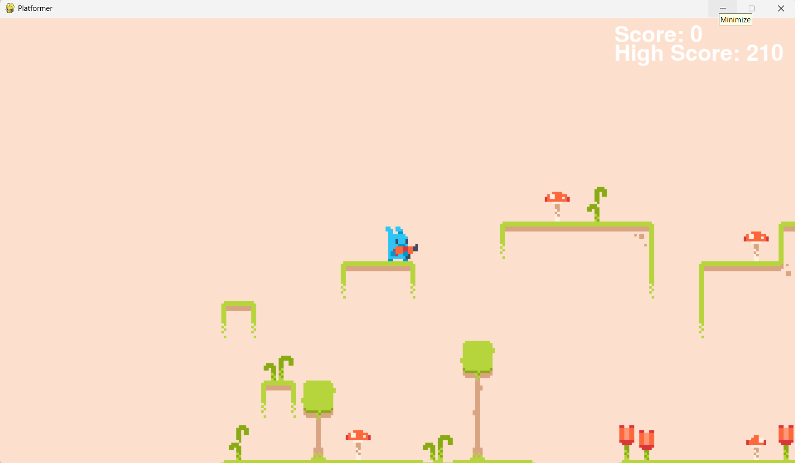
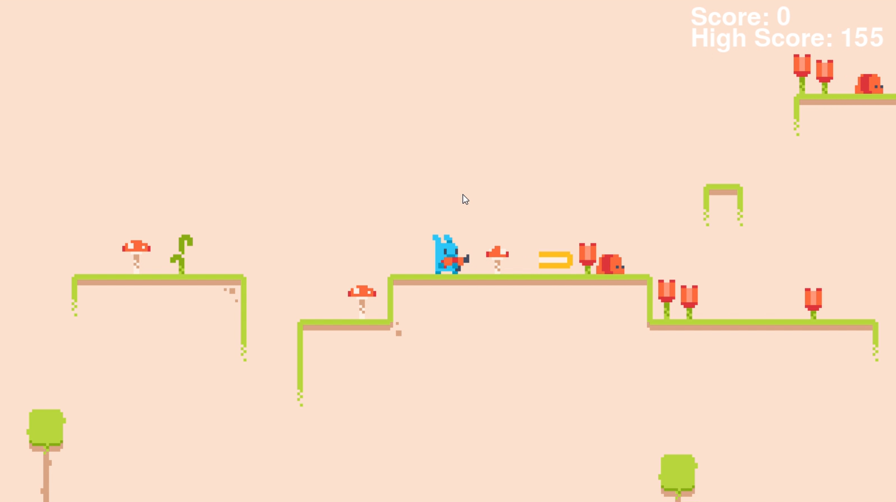
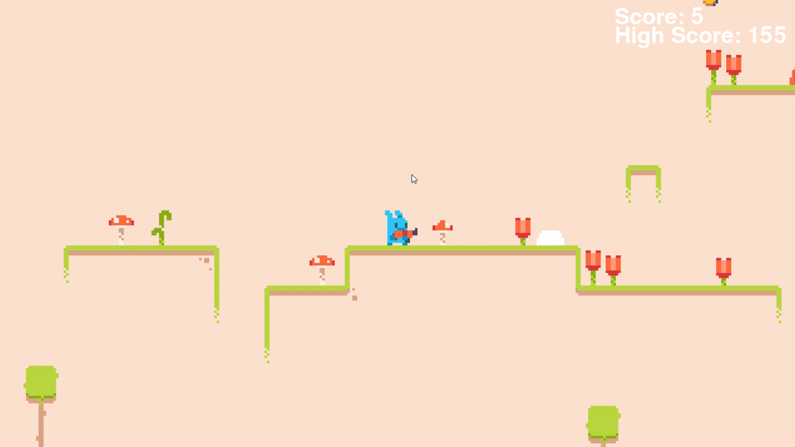
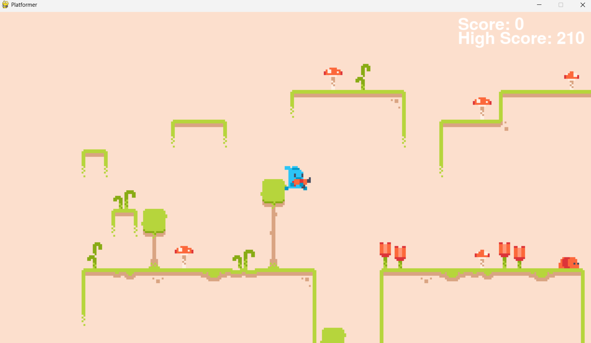
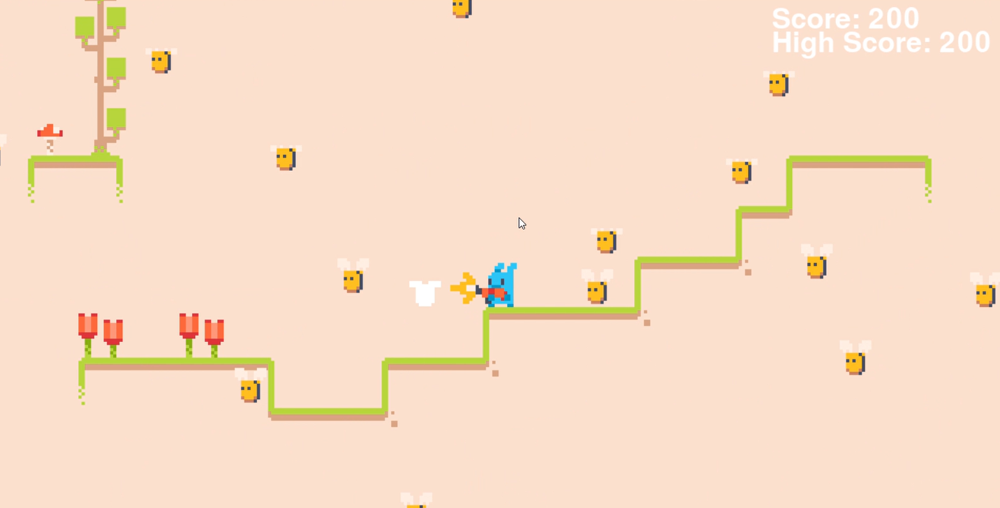
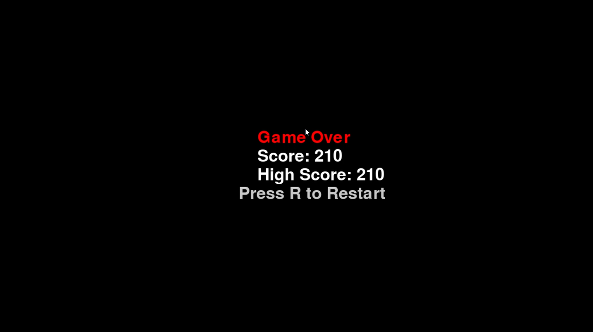

<h2>Gravity Dash Game<h2></h2>

<h4>About</h4>
Gravity Dash is a 2D platformer game developed using Python, Pygame, and Pytmx.
It challenges players to jump across platforms, shoot animated enemies like bees and worms, and survive as long as possible without falling off a platform.

The game includes responsive controls, smooth animations, real-time scoring, and a retry mechanism for added engagement.

<h2>How Run the Game:</h2> <ul> <li><h3>Install Dependencies</h3></li> <ol> <li>Make sure Python is installed.</li> <li>Install Pygame and Pytmx:</li>

    pip install pygame pytmx
</ol> <li><h3>Run the Game</h3></li> <ol> <li>Open `main.py` in your preferred code editor or terminal.</li> <li>Run the game:</li>

    python main.py
</ol> </ul>

<h2>Features</h2>

🎮 Player movement with gravity-based jump mechanics

🐝 Bees fly in sine wave patterns to challenge players

🪱 Worms patrol the edges of platforms

💥 Game over screen with Retry Mechanism

🎯 Real-time score counter

🔊 Background music and sprite animations

<h2>Controls</h2>

<b>Movement:</b> Side Arrow keys for movement and Space Bar for jumping

<b>Shooting:</b> Press <b>S</b> to shoot bullets

<b>Retry:</b> Press <b>R</b> to restart
 
<h2>Screenshots</h2>

